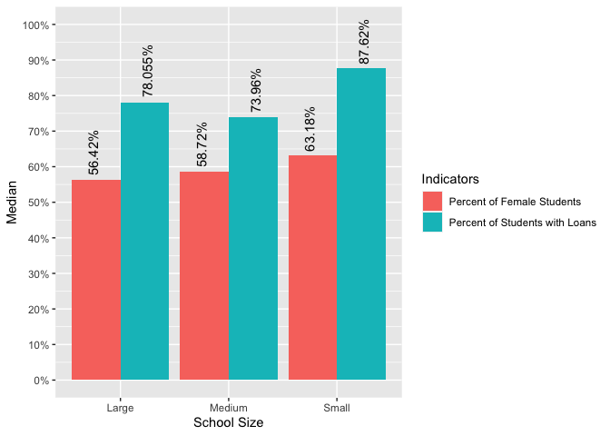
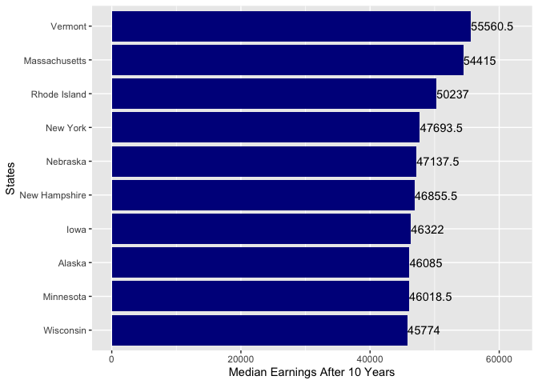
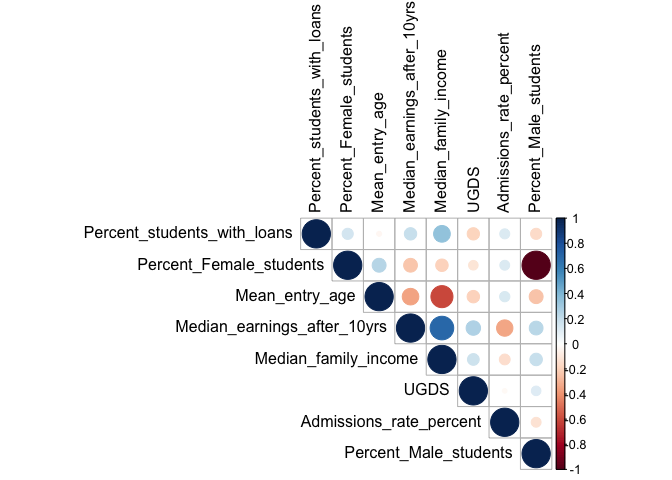

University Data Analysis
================
Houssam Hallouch

## Introduction

In this study, we intend to explore the different attributes of 4599
colleges and universities in 59 states.


Through those data visualizations and analyses different insights are
drawn regarding the school size, states, percent students with loans,
percent female students, median earnings after 10 years, and so on.
There we have explored that small school sizes have a higher median
percent of students with loans than medium and large school sizes, while
medium school sizes have the lowest. Female students are also higher at
small schools than large schools. We can also observe that among top 10
states Vermont has the highest median percent of students with loans,
Rhode Island has the second highest, and South Dakota has the third
highest. We can also observe that among top 10 states Vermont has the
highest median earnings after 10 years, Massachusetts the second, and
Rhode Island the third. The final regression model output provides some
interesting fact like the independent variables such as percent of
students with loans, mean entry age, median family income, UGDS,
admissions rate percent, and school size have statistically significant
impact on median earnings after 10 years. Overall, percent of students
with loans, admissions rate percent, and small school size have negative
impact on median earnings after 10 years where mean entry age, median
family income, and UGDS have positive impact on median earnings after 10
years.

## Dictionary

This dataset contains 4599 observations for 12 attributes regarding
different institutions of 59 states.

1.  UNITID: Unique identification number for each college or university.

2.  Institution_name: The name of the institution.

3.  Percent_students_with_loans: The proportion of students at the
    institution who have borrowed money to pay for their education is
    known as the percent_students_with_loans. This variable gives
    information about the financial situation of the institution’s
    students.

4.  Percent_Female_students: The percentage of female students enrolled
    in the institution.

5.  Mean_entry_age: The average age of students when they enter the
    institution.

6.  Median_earnings_after_10yrs: The median earnings of students 10
    years after graduation from the institution. This variable indicates
    the potential earnings resulting from attending the college or
    university.

7.  Median_family_income: The median family income of students attending
    the college or university. This variable gives information about the
    students’ socioeconomic backgrounds.

8.  UGDS: The institution’s undergraduate enrollment, which represents
    the total number of students enrolled in undergraduate programs.
    This variable indicates the size of the student population.

9.  Admissions_rate_percent: The percentage of applicants admitted to
    the institution. This variable gives information about the
    competitiveness of the admissions process at the institution.

10. School_size: A measure of the institution’s size, which can refer to
    factors such as enrolment, faculty size, or campus size. This
    variable indicates the scale of the college or university.

11. State_Name: The name of the state where the institution is located.

12. Percent_Male_students: The percentage of male students enrolled in
    the institution.

## Data Cleaning

1.  Grouped the dataset by **School_size** to get the median **Percent
    of Students with Loans** and median **Percent of Female Students**.
    Next formatted the dataset from wide to long.

    ``` r
    d1<-dt %>% 
      group_by(School_size) %>% 
      summarise(`Percent of Students with Loans`=median(Percent_students_with_loans,na.rm = T),
                `Percent of Female Students`=median(Percent_Female_students,na.rm=T)) %>% 
      gather(key = "Variable",value = "Values",-1)
    ```

2.  Grouped the dataset by **State_Name** to get the median **Percent of
    Students with Loans.** Next, sorted the dataset by median **Percent
    of Students with Loans** in descending order. Finally, selected top
    10 observations from those.

    ``` r
    d2<-dt %>% 
      group_by(State_Name) %>% 
      summarise(`Percent of Students with Loans`=round(median(Percent_students_with_loans,na.rm = T),2)) %>%
      arrange(desc(`Percent of Students with Loans`)) %>% 
      top_n(10)
    ```

        ## Selecting by Percent of Students with Loans

3.  Grouped the dataset by **State_Name** to get the **Median Earnings
    After 10 Years.** Next, sorted the dataset by **Median Earnings
    After 10 Years** in descending order. Finally, selected top 10
    observations from those.

    ``` r
    d3<-dt %>% 
      group_by(State_Name) %>% 
      summarise(`Median Earnings After 10 Years`=round(median(Median_earnings_after_10yrs,na.rm = T),2)) %>%
      arrange(desc(`Median Earnings After 10 Years`)) %>% 
      top_n(10)
    ```

        ## Selecting by Median Earnings After 10 Years

4.  Selected the numeric variables from the dataset for correlation
    matrix.

    ``` r
    dt.n<-dt[,-c(1,2,10,11)]
    ```

5.  Created the correlation matrix considering pairwise missing removal.

    ``` r
    dt.matrix <- cor(dt.n,use="pairwise.complete.obs")
    ```

## Data Visualizations

### Median Indicators by School Size

``` r
d1 %>% 
  ggplot(aes(x=School_size,y=Values,group=Variable,fill=Variable))+
  geom_bar(stat = "identity",position = "dodge")+
  geom_text(aes(label=paste0(Values,"%")),position = position_dodge(width=1),hjust=-0.1,angle=90)+
  scale_y_continuous(labels = function(value) paste0(value, "%"),breaks = seq(0,100,by=10),limits = c(0,100))+
  labs(x="School Size",y="Median",fill="Indicators")
```

<!-- -->

From the above grouped bar chart, we can observe that the median percent
of students with loans is comparatively higher for small school sizes
compared to medium and large school sizes. Among all the school sizes,
medium school sizes show the lowest median percent of students with
loans.

Next, we observe that the median percent of female students is
comparatively higher at small schools and comparatively lower at large
schools.

### Top 10 States with Highest Median Percent of Students with Loans

``` r
d2 %>% 
  ggplot(aes(x=(reorder(State_Name,`Percent of Students with Loans`)),y=`Percent of Students with Loans`)) +
  geom_segment( aes(x=(reorder(State_Name,`Percent of Students with Loans`)), xend=(reorder(State_Name,`Percent of Students with Loans`)), y=0, yend=`Percent of Students with Loans`)) +
  geom_point( size=5, color="red", fill=alpha("orange", 0.3), alpha=0.7, shape=21, stroke=2) +
  geom_text(aes(label=paste0(`Percent of Students with Loans`,"%")),hjust=-0.3)+
  scale_y_continuous(labels = function(value) paste0(value, "%"),breaks = seq(0,100,by=10),limits = c(0,110))+
  labs(y='Median Percent of Students with Loans',x='States')+
  coord_flip()
```

<!-- -->

The above lolipop chart shows the top 10 states having highest median
percent of students with loans among those 59 states. Here, we can see
that the highest median percent of students with loans is observed for
**Vermont** state. The second highest median percent of students with
loans is observed for **Rhode Island** state. The third highest median
percent of students with loans is observed for **South Dakota** state.

### Top 10 States with Highest Median Earnings After 10 Years

``` r
d3 %>% 
  ggplot(aes(x=(reorder(State_Name,`Median Earnings After 10 Years`)),y=`Median Earnings After 10 Years`)) +
  geom_bar(stat = "identity",fill="blue4")+
  geom_text(aes(label=`Median Earnings After 10 Years`),hjust=-0.01)+
  ylim(0,62000)+
  labs(y='Median Earnings After 10 Years',x='States')+
  coord_flip()
```

<!-- -->

The above bar chart shows the top 10 states having highest median
earnings after 10 years among those 59 states. Here, we can see that the
highest median earnings after 10 years is observed from **Vermont**
state. The second highest median earnings after 10 years is observed
from **Massachusetts** state. The third highest median earnings after 10
years is observed from **Rhode Island** state.

### Correlation Matrix among All the Numeric Attributes

``` r
corrplot(dt.matrix, type="upper", tl.col="black")
```

<!-- -->

The above correlation matrix showed the correlation between eight
numeric variables in the dataset. Here, we can observe that
**Percent_students_with_loans** is weakly positively related to
**Percent_Female_students**, **Median_earnings_after_10yrs**, and
**Median_family_income** (because the circles are showing blueish colors
and the size of the circle is smaller) but negatively weakly related to
**UGDS** and **Percent_Male_students** (because the circle is showing a
redish color and the circle is smaller). Next, we can observe that the
**Percent_Female_students** and **Percent_Male_students** are perfectly
negatively related to each other (so, we can’t use both of those
variables together in the same linear model due to multicollinearity).
Finally, we can observe that **Median_family_income** is moderately
negatively related to **Mean_entry_age** but moderately positively
related to **Median_earnings_after_10yrs**.

## Data Analyses

### Multiple Linear Regression Model 1

Here, the multiple linear regression model is created using
**Median_earnings_after_10yrs** as dependent variable and
**Percent_students_with_loans, Percent_Female_students, Mean_entry_age,
Median_family_income, UGDS, Admissions_rate_percent,** and
**School_size** as independent variables. Here, **UNITID,
Institution_name,** and **State_Name** are not used for the model
because those are nominal variables with too many unique observations
and **Percent_Male_students** is not used because it is perfectly
correlated to **Percent_Female_students**.

``` r
options(scipen = 999)
model1<-lm(Median_earnings_after_10yrs~.-UNITID-Institution_name-State_Name-Percent_Male_students,data = dt)
summary(model1)
```

    ## 
    ## Call:
    ## lm(formula = Median_earnings_after_10yrs ~ . - UNITID - Institution_name - 
    ##     State_Name - Percent_Male_students, data = dt)
    ## 
    ## Residuals:
    ##    Min     1Q Median     3Q    Max 
    ## -35182  -6627  -1636   5016  79540 
    ## 
    ## Coefficients:
    ##                                Estimate  Std. Error t value
    ## (Intercept)                 28568.51782  3522.94724   8.109
    ## Percent_students_with_loans   -71.82979    22.97523  -3.126
    ## Percent_Female_students       -44.03212    23.06143  -1.909
    ## Mean_entry_age               1199.41952   115.25154  10.407
    ## Median_family_income            0.47980     0.01758  27.286
    ## UGDS                            0.13781     0.06553   2.103
    ## Admissions_rate_percent      -186.13255    13.15750 -14.147
    ## School_sizeMedium            -545.95215  1654.04927  -0.330
    ## School_sizeSmall            -6553.62086  1934.30517  -3.388
    ##                                         Pr(>|t|)    
    ## (Intercept)                  0.00000000000000101 ***
    ## Percent_students_with_loans             0.001802 ** 
    ## Percent_Female_students                 0.056398 .  
    ## Mean_entry_age              < 0.0000000000000002 ***
    ## Median_family_income        < 0.0000000000000002 ***
    ## UGDS                                    0.035628 *  
    ## Admissions_rate_percent     < 0.0000000000000002 ***
    ## School_sizeMedium                       0.741391    
    ## School_sizeSmall                        0.000721 ***
    ## ---
    ## Signif. codes:  0 '***' 0.001 '**' 0.01 '*' 0.05 '.' 0.1 ' ' 1
    ## 
    ## Residual standard error: 10770 on 1588 degrees of freedom
    ##   (3002 observations deleted due to missingness)
    ## Multiple R-squared:  0.4998, Adjusted R-squared:  0.4973 
    ## F-statistic: 198.4 on 8 and 1588 DF,  p-value: < 0.00000000000000022

From the above regression output, we can say that the overall regression
model is statistically significant as the p-value of F-statistic is less
than 0.05. We can also observe that the value of Adjusted R-squared is
0.4973 which indicates that among total variations of
**Median_earnings_after_10yrs**, 49.73% variations can be explained by
**Percent_students_with_loans, Percent_Female_students, Mean_entry_age,
Median_family_income, UGDS, Admissions_rate_percent,** and
**School_size.**

Next, we can observe that the p-values of the regression coefficients
are not all less than 0.05. Like the p-value of regression coefficient
of **Percent_Female_students** is 0.056398 which is greater than 0.05.
So, we can say that this predictor is not showing any statistically
significant impact on **Median_earnings_after_10yrs** in the presence of
other predictors**.**

### Multiple Linear Regression Model 2

Now, we can recreate the regression model in a backward step-wise
approach to select only the statistically significant predictors.

``` r
model2<-ols_step_backward_p(model1,prem = 0.05)
summary(model2$model)
```

    ## 
    ## Call:
    ## lm(formula = paste(response, "~", paste(preds, collapse = " + ")), 
    ##     data = l)
    ## 
    ## Residuals:
    ##    Min     1Q Median     3Q    Max 
    ## -34014  -6637  -1609   5019  78723 
    ## 
    ## Coefficients:
    ##                                Estimate  Std. Error t value
    ## (Intercept)                 28402.02739  3478.17512   8.166
    ## Percent_students_with_loans   -76.58754    22.52433  -3.400
    ## Mean_entry_age               1108.56855   106.37627  10.421
    ## Median_family_income            0.47928     0.01725  27.783
    ## UGDS                            0.14045     0.06519   2.154
    ## Admissions_rate_percent      -186.01146    12.90305 -14.416
    ## School_sizeMedium            -550.24065  1646.25977  -0.334
    ## School_sizeSmall            -6495.67397  1924.93297  -3.374
    ##                                         Pr(>|t|)    
    ## (Intercept)                 0.000000000000000635 ***
    ## Percent_students_with_loans             0.000690 ***
    ## Mean_entry_age              < 0.0000000000000002 ***
    ## Median_family_income        < 0.0000000000000002 ***
    ## UGDS                                    0.031352 *  
    ## Admissions_rate_percent     < 0.0000000000000002 ***
    ## School_sizeMedium                       0.738244    
    ## School_sizeSmall                        0.000757 ***
    ## ---
    ## Signif. codes:  0 '***' 0.001 '**' 0.01 '*' 0.05 '.' 0.1 ' ' 1
    ## 
    ## Residual standard error: 10730 on 1622 degrees of freedom
    ##   (2969 observations deleted due to missingness)
    ## Multiple R-squared:  0.4994, Adjusted R-squared:  0.4972 
    ## F-statistic: 231.2 on 7 and 1622 DF,  p-value: < 0.00000000000000022

The above model output is showing all the predictors’ regression
coefficients p-values are less than 0.05 which indicates that those
existing predictors statistically significantly predict
**Median_earnings_after_10yrs.** Now, we can see that the value of
Adjusted R-squared is 0.4972 which indicates that among total variations
of **Median_earnings_after_10yrs**, 49.72% variations can be explained
by **Percent_students_with_loans, Mean_entry_age, Median_family_income,
UGDS, Admissions_rate_percent,** and **School_size.**

Now, we can interpret the individual impact of
**Percent_students_with_loans, Mean_entry_age, Median_family_income,
UGDS, Admissions_rate_percent,** and **School_size** on
**Median_earnings_after_10yrs.**

- **Percent_students_with_loans:** The regression coefficient of
  **Percent_students_with_loans** is -76.58754 which indicates that for
  per unit increment of **Percent_students_with_loans**, the
  **Median_earnings_after_10yrs** will be decreased by 76.58754 units on
  average while considering all other variables constant.

- **Mean_entry_age:** The regression coefficient of **Mean_entry_age**
  is 1108.56855 which indicates that for per unit increment of
  **Mean_entry_age**, the **Median_earnings_after_10yrs** will be
  increased by 1108.56855 units on average while considering all other
  variables constant.

- **Median_family_income:** The regression coefficient of
  **Median_family_income** is 0.47928 which indicates that for per unit
  increment of **Median_family_income**, the
  **Median_earnings_after_10yrs** will be increased by 0.47928 units on
  average while considering all other variables constant.

- **UGDS:** The regression coefficient of **UGDS** is 0.14045 which
  indicates that for per unit increment of **UGDS**, the
  **Median_earnings_after_10yrs** will be increased by 0.14045 units on
  average while considering all other variables constant.

- **Admissions_rate_percent:** The regression coefficient of
  **Admissions_rate_percent** is -186.01146 which indicates that for per
  unit increment of **Admissions_rate_percent**, the
  **Median_earnings_after_10yrs** will be decreased by 186.01146 units
  on average while considering all other variables constant.

- **School_size:** The regression coefficient of **School_sizeSmall** is
  -6495.67397 which indicates that if the **School_size is Small**, the
  **Median_earnings_after_10yrs** will be decreased by 6495.67397 units
  on average compared to **School_size Large** while considering all
  other variables constant.

## Conclusion

Based on data visualizations and analysis, small school sizes have a
greater median % of students having loans than medium and large school
sizes, while medium school sizes have the lowest. Female students are
also more prevalent in small schools than in large institutions. Vermont
has the highest median percent of students with debt among the top ten
states, Rhode Island has the second highest, and South Dakota has the
third highest. The final regression model output shows that all the
predictors’ regression coefficients p-values are less than 0.05, which
indicates that those existing predictors statistically significantly
predict Median_earnings_after_10yrs. The value of Adjusted R-squared is
0.4972, which indicates that among total variations of
Median_earnings_after_10yrs, 49.72% variations can be explained by
Percent_students_with_loans, Mean_entry_age, Median_family_income, UGDS,
Admissions_rate_percent, and School_size. Overall, percent of students
with loans, admissions rate percent, and small school size have negative
impact on median earnings after 10 years where mean entry age, median
family income, and UGDS have positive impact on median earnings after 10
years.
